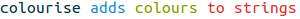
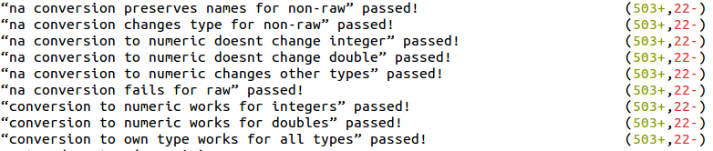

colourise v0.1.0
=========

Colourise colours strings printed by R.

### Examples

 </img>
 </img>

### Installation


```R
if (!require(devtools)) {
    install.packages("devtools"); library(devtools)
}

devtools::install_github("rgrannell1/colourise", ref = 'releases')
```